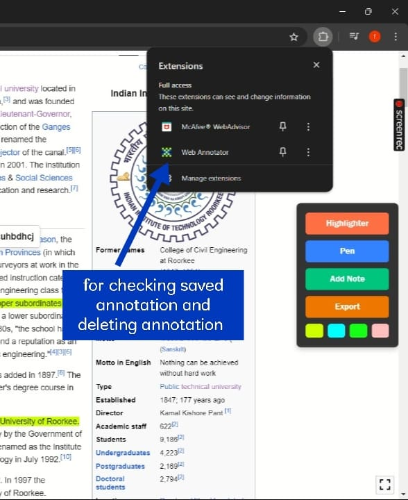
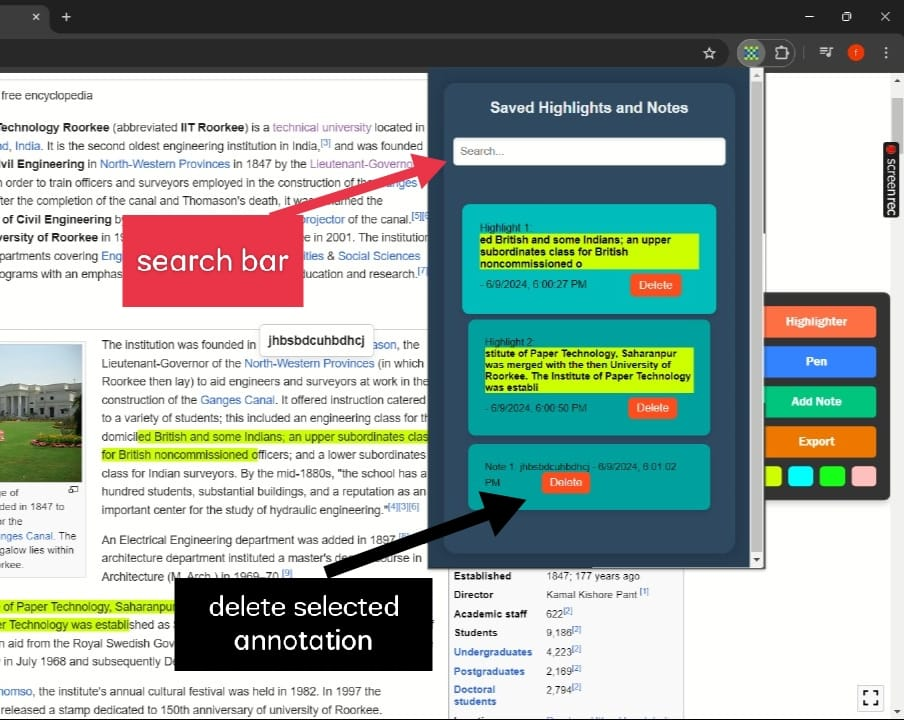
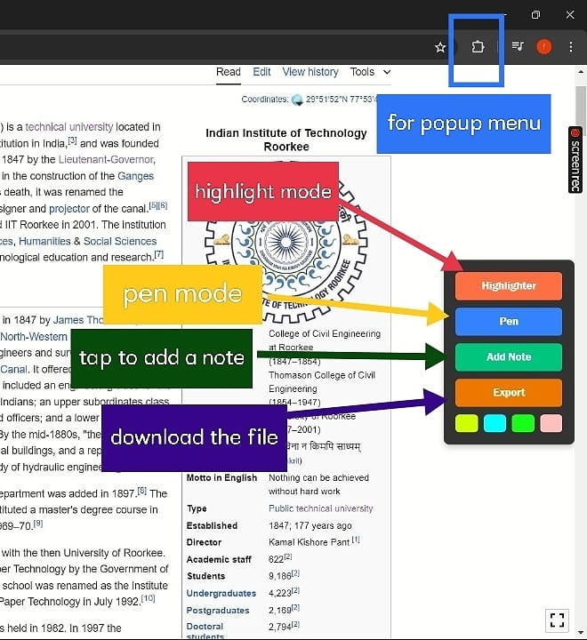

# Web Annotator Chrome Extension

## Overview

The Web Annotator is a Chrome extension that allows users to highlight text, write using a pen mode, add notes to web pages, and export the annotated web pages. The extension provides a toolbar with various tools and color options to facilitate smooth annotation and easy access to saved annotations.

## Features

1. **Highlight Text**: Highlight selected text in four different colors.
2. **Pen Mode**: Draw freely on the web page using a pen.
3. **Add Notes**: Add draggable notes to the web page.
4. **Color Options**: Choose from four different colors for highlighting and pen mode.
5. **Export Annotations**: Export the web page with all annotations to an HTML file.
6. **Search and Filter Annotations**: Easily search and filter saved annotations in the popup.

## File Structure

- `background.js`: Handles the installation of the extension.
- `content.js`: Contains the main logic for annotation features and manages storage of highlights and notes.
- `popup.js`: Manages the display and deletion of saved annotations in the popup.
- `content.css`: Styles for the annotation toolbar and notes.
- `popup.css`: Styles for the popup display.
- `manifest.json`: Configuration file for the Chrome extension.
- `popup.html`: HTML structure for the popup.

## Installation

1. Clone the repository or download the files.
2. Open Chrome and navigate to `chrome://extensions/`.
3. Enable Developer mode by toggling the switch in the top right corner.
4. Click on "Load unpacked" and select the directory containing the extension files.
5. The Web Annotator extension should now be installed and ready to use.

## Usage

1. **Highlight Text**:
   - Click on the "Highlighter" button on the toolbar.
   - Select the desired color from the color picker.
   - Highlight text on the web page by selecting it.

2. **Pen Mode**:
   - Click on the "Pen" button on the toolbar.
   - Draw on the web page using the mouse.

3. **Add Notes**:
   - Click on the "Add Note" button on the toolbar.
   - Enter the note text in the prompt.
   - The note will appear on the web page and can be dragged to the desired position.

3. **Delete Annotations**:
   - Click on the "Delete" button on the Popup.
   - The particular annotation will be deleted.

4. **Export Annotations**:
   - Click on the "Export" button on the toolbar.
   - The annotated web page will be exported as an HTML file.

5. **Search and Filter Annotations**:
   - Open the extension popup by clicking the extension icon.
   - Use the search input to filter through the saved highlights and notes.

## Code Breakdown

### `background.js`

This file handles the initial installation of the extension, logging a message when installed.

### `content.js`

Contains the main logic for creating the toolbar, highlighting text, toggling pen mode, adding notes, and saving/retrieving annotations from storage.

### `popup.js`

Handles displaying the list of saved annotations, filtering them, and allowing deletion of specific annotations.

### `content.css`

Styles for the toolbar and notes to ensure a user-friendly interface.

### `popup.css`

Styles for the popup display, including the search input and list of annotations.

### `manifest.json`

Configuration file for the Chrome extension, specifying permissions, background scripts, content scripts, and the default popup.

### `popup.html`

HTML structure for the popup, displaying saved highlights and notes.

## Limitations

1.Pen Mode: The drawing canvas does not persist drawings across page reloads.

2.Highlight Accuracy: Highlighted text may not always be accurately restored after page reloads if the web page content changes.

3.Export: Exported annotations are in HTML format, which might not preserve all styling and layout accurately, but contain all the annotations perfectly.

## References

1.Chrome Extension Documentation

2.HTML5 Canvas

3.Javascript.info website

4.StackOverflow.com website

5.Youtube Channels

